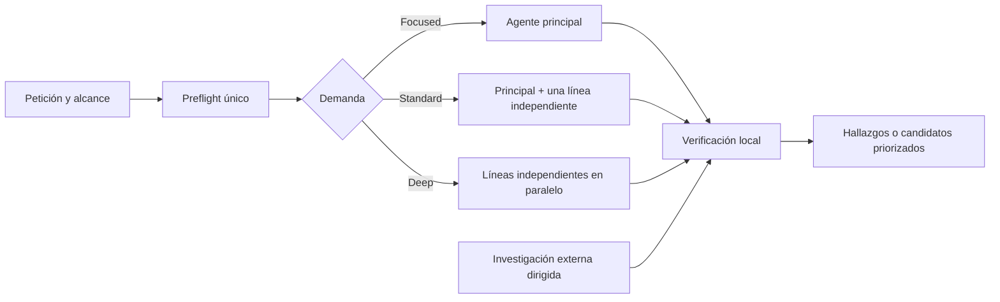

# Z80 Skills — Adaptive Research

**Idiomas:** [English](README.md) · Español

Plugin para Codex con tres skills complementarios para analizar proyectos Z80,
especialmente software de ZX Spectrum escrito en ensamblador, C o una mezcla de
ambos con z88dk o SDCC.

El objetivo no es producir listas genéricas de trucos. Los skills inspeccionan
el código y los artefactos actuales, adaptan la profundidad y el paralelismo al
riesgo real y distinguen claramente entre evidencia probada, estimaciones e
hipótesis.

> Evidence-first auditing, size reduction and multi-objective optimization for
> Z80 and ZX Spectrum projects.

## Contenido

- [Qué incluye](#qué-incluye)
- [Qué aporta frente a un análisis genérico](#qué-aporta-frente-a-un-análisis-genérico)
- [Ejecución adaptativa y multiagente](#ejecución-adaptativa-y-multiagente)
- [Investigación externa dirigida](#investigación-externa-dirigida)
- [Detalle de cada skill](#detalle-de-cada-skill)
- [Instalación](#instalación)
- [Uso](#uso)
- [Artefactos recomendados](#artefactos-recomendados)
- [Seguridad y límites](#seguridad-y-límites)
- [Estructura del repositorio](#estructura-del-repositorio)
- [Validación](#validación)
- [Licencia y copyright](#licencia-y-copyright)

## Qué incluye

| Skill | Pregunta principal | Resultado |
|---|---|---|
| `audit-z80` | ¿Hay defectos, corrupción, errores ABI, riesgos ISR/memoria/hardware o regresiones? | Hallazgos priorizados por severidad y confianza, con evidencia, verificación y riesgo residual. |
| `shrink-z80` | ¿Cómo reducir almacenamiento, tamaño enlazado, memoria residente, BSS/stack, bancos u overlays? | Reducciones netas clasificadas por seguridad y por calidad de la evidencia. |
| `optimize-z80` | ¿Cuál es el cuello de botella real y qué cambios ofrecen el mejor equilibrio entre tamaño, velocidad, RAM, renderizado y latencia? | Hasta tres experimentos priorizados con impacto, riesgo, rollback y plan de validación. |

Los tres skills se solapan solo donde es útil:

- Usa `audit-z80` para corrección y seguridad técnica.
- Usa `shrink-z80` para una búsqueda exhaustiva centrada exclusivamente en
  tamaño.
- Usa `optimize-z80` para decidir entre objetivos que compiten entre sí y
  ordenar los siguientes experimentos.

## Qué aporta frente a un análisis genérico

### Evidencia local antes que folklore

- Solo el código actual y los artefactos demostrablemente frescos pueden
  confirmar un hallazgo o una mejora.
- Los mapas, símbolos, listings, ASM generado y binarios enlazados cuentan como
  evidencia únicamente cuando corresponden a la misma revisión, configuración
  y target.
- Escáneres, agentes, conocimiento previo, foros y repositorios generan
  candidatos; no sustituyen la verificación local.
- Un artefacto obsoleto reduce explícitamente la confianza a estados como
  `NEEDS BUILD`, `REQUIERE BUILD` o `SPECULATIVE`.
- En proyectos con varios targets, una propuesta solo supera la puerta de
  promoción cuando cada target satisface sus propios límites.

### Carga progresiva

Cada `SKILL.md` funciona como un dispatcher compacto. Codex carga primero el
contrato común y después únicamente las referencias y scripts pertinentes para
el problema observado. Esto evita introducir en contexto manuales, técnicas o
logs que no pueden cambiar el resultado.

### Herramientas deterministas

El plugin incluye analizadores Python sin dependencias externas para perfilar
el proyecto, resumir mapas, detectar patrones, inventariar fronteras ABI,
evaluar frescura de artefactos, localizar library pulls y estimar candidatos.
Sus resultados son señales reproducibles, no veredictos automáticos.

## Ejecución adaptativa y multiagente

Los skills no presuponen que existan subagentes ni lanzan un roster fijo. Tras
un único preflight clasifican la demanda:

| Demanda | Estrategia |
|---|---|
| **Focused** | El agente principal resuelve una pregunta acotada sin delegar. |
| **Standard** | El principal conserva la verificación y, si hay capacidad, un delegado investiga la incertidumbre independiente más valiosa. |
| **Deep** | Se ejecutan en paralelo tantas líneas independientes como sean útiles y estén disponibles; normalmente no más de tres delegados por oleada. |



Reglas de eficiencia:

- Se reserva capacidad para que el agente principal mantenga el contexto
  completo y juzgue la evidencia.
- Cada delegado recibe la misma línea base inmutable, una pregunta falsable y
  un conjunto estrecho de archivos o artefactos.
- Las ramas son independientes; solo se solapan para una comprobación
  adversarial deliberada.
- Los escáneres deterministas se ejecutan una vez y se comparte un resumen, no
  el log completo.
- El agente principal deduplica, aplica vetos, verifica anclas locales y conserva
  la responsabilidad sobre severidad, contabilidad y ranking.
- Una segunda oleada solo se abre si aparece un nuevo cuello de botella, una
  contradicción o una pregunta de verificación concreta.
- Se detiene el análisis cuando las nuevas líneas solo repiten candidatos o ya
  no pueden cambiar la decisión.
- Si no hay subagentes, se recorren serialmente las líneas que todavía pueden
  alterar el resultado. El umbral de evidencia no se rebaja.

## Investigación externa dirigida

La búsqueda externa se activa para resolver una incertidumbre concreta, no
para adornar el informe ni repetir una lista de sitios conocidos.

### Cuándo se activa

- El usuario solicita investigación profunda en foros, blogs, repositorios o
  demoscene.
- Una versión de compilador, ABI, firmware, emulador, modelo de hardware o
  detalle de timing puede cambiar un hallazgo principal.
- El código, los artefactos generados y la documentación se contradicen.
- Un análisis profundo mantiene un punto ciego material.
- Una secuencia de instrucciones, helper, codec, renderer, loader o esquema de
  bancos requiere arqueología de código.

### Cómo busca

1. Formula una pregunta desde una firma local mínima: opcode, símbolo, fragmento
   emitido, versión, dirección, síntoma o restricción.
2. Busca fragmentos exactos y conceptos con vocabulario alternativo.
3. Amplía términos en inglés, español, polaco, ruso, checo y otras comunidades
   regionales pertinentes.
4. Diversifica las fuentes: código, tests, commits, issues, forks, emuladores,
   mediciones de hardware, listas de correo, foros archivados, blogs personales,
   repositorios pequeños, disassemblies, generadores y material demoscene.
5. Sigue autores, citas, forks, problemas relacionados y enlaces archivados.
6. Intenta refutar cada finalista buscando bugs, regresiones, issues cerrados o
   rechazados y fallos específicos por modelo.
7. Verifica CPU, modelo Spectrum, ABI, interrupciones, paginación, memoria,
   toolchain y timing antes de transferir una técnica.

La investigación tiene presupuesto y reglas de parada: conserva solo las pocas
fuentes capaces de cambiar una decisión. Una técnica popular sin ancla en el
proyecto permanece como hipótesis.

Para proteger proyectos privados, las búsquedas usan únicamente firmas mínimas
normalizadas; nunca deben subir código privado ni identificadores del proyecto.

## Detalle de cada skill

### `audit-z80`

Auditoría de solo lectura para encontrar defectos reales y riesgos
reproducibles.

**Cobertura**

- fronteras C/ASM, calling conventions, registros, flags y stack;
- ISR, `DI`/`EI`, reentrada y estado compartido;
- mapas de memoria, BSS, stack gap, bancos y overlays;
- firmware, ROM, RST 8, esxDOS, divMMC y diferencias entre modelos;
- semántica C, buffers, promoción, signedness y lifetime;
- ASM/listings generados, reglas copt y comportamiento z88dk/SDCC;
- ULA, contention, puertos, timing y regresiones visibles para el usuario.

**Modos**

- `auto`: preflight y profundidad adaptativa.
- `preflight`: perfil y señales de escalado sin auditoría completa.
- `full` / `diverge`: cobertura amplia con las mismas puertas de evidencia.
- Focos: `asm`, `c`, `abi`, `isr`, `memory`, `spectrum-hw`, `esxdos`,
  `toolchain`, `copt` y `map`.

**Helpers principales**

- `preflight_scan.py`: inventario de fuentes, artefactos y señales de riesgo.
- `z80_pattern_scan.py`: patrones estructurales ASM/C.
- `abi_inventory.py`: declaraciones, convenciones y fronteras C/ASM.
- `map_summary.py`: símbolos, direcciones y aproximación del stack gap.
- `smoke_test.py`: comprobación reproducible de los analizadores.

La salida pone primero los hallazgos que superan la puerta de promoción. Si
ninguno sobrevive, lo indica y señala el riesgo residual más importante en vez
de rellenar el informe con observaciones débiles.

### `shrink-z80`

Optimizador de tamaño basado en mediciones y contabilidad neta.

**Objetivos separados**

- tamaño de almacenamiento;
- CODE/DATA enlazado;
- memoria residente;
- BSS y margen de stack;
- techo de banco u overlay;
- reserva mínima por target.

**Modos**

- `scan`: análisis adaptativo completo.
- `preflight`: perfil de artefactos y presión.
- Focos: `deadcode`, `dedup`, `micro`, `data`, `compress`, `refactor`,
  `arch`, `libpull`, `blackbelt` y `reserve`.
- `diverge`: exploración amplia sin relajar la prueba.

**Orden de ataque**

1. Arquitectura, residencia, datos y librerías enlazadas.
2. Código generado, helpers y representaciones repetidas.
3. Compresión con coste neto y RAM pico separados.
4. Microoptimizaciones y técnicas de mayor riesgo solo cuando pueden importar.

No suma propuestas dependientes, subsumidas, incompatibles o todavía no
construidas. Distingue seguridad (`SAFE`, `AGGRESSIVE`, `EXPERIMENTAL`) y
calidad de medida (`EXACTO`, `ESTIMADO`, `REQUIERE BUILD`).

**Helpers principales**

- `preflight_scan.py` y `artifact_freshness.py`;
- `map_summary.py`, `deadcode_scan.py` y `libpull_scan.py`;
- `generated_helper_scan.py` y `literal_dup_scan.py`;
- `z80_pattern_scan.py`;
- `net_compression_check.py`, que separa ahorro de almacenamiento y RAM pico.

### `optimize-z80`

Motor de estrategia multiobjetivo para decidir qué optimizar primero y cómo
validarlo.

**Ámbitos**

- tamaño, ciclos y latencia;
- RAM, stack y layout de datos;
- renderizado, contention e I/O;
- bancos, overlays y transiciones;
- C a ASM, ABI, librerías, codegen y toolchain;
- restricciones por modelo y hardware.

**Modos**

- `Triage`: inspección de solo lectura sin build. Los artefactos obsoletos
  limitan la confianza.
- `Measurement`: baseline reproducible en un worktree desechable.
- `Experiment`: requiere aprobación explícita, cambia una sola variable y se
  elimina salvo que el usuario pida conservarla.

Primero identifica el cuello de botella dominante. Después aplica vetos de
política y target, fusiona duplicados, audita los finalistas y recomienda como
máximo tres experimentos siguientes.

Cada candidato incluye:

- ancla y frescura de la evidencia;
- zona, mecanismo e impacto esperado;
- efecto sobre tamaño, ciclos/latencia, RAM/stack y UX cuando corresponda;
- riesgo, targets, restricciones, rollback y validación;
- confianza (`PROVEN`, `LIKELY` o `SPECULATIVE`);
- motivo por el que supera ahora a las alternativas.

Los estimadores estáticos de ciclos, mapas o patrones no constituyen prueba por
sí solos.

## Instalación

### Requisitos

- Codex con soporte para plugins y skills.
- Git para clonar y actualizar el repositorio.
- Python 3.9 o posterior para los helpers; Python 3.11 o posterior es
  recomendable para la ruta completa de políticas TOML de `optimize-z80`.
- z88dk o SDCC únicamente cuando el proyecto o una medición reproducible los
  requiera.

### Primera instalación

El instalador espera que el repositorio esté exactamente en
`~/plugins/z80-skills`.

```sh
git clone https://github.com/IgnacioMonge/z80-skills.git ~/plugins/z80-skills
cd ~/plugins/z80-skills
python3 scripts/install_personal_marketplace.py
codex plugin add z80-skills@personal
```

`install_personal_marketplace.py` crea o actualiza
`~/.agents/plugins/marketplace.json`, conserva las demás entradas y sustituye
solo la entrada llamada `z80-skills`.

Abre una tarea nueva de Codex después de instalar: el catálogo de skills se
carga al iniciar la tarea y no se actualiza dinámicamente dentro de una tarea
ya abierta.

### Actualización

```sh
git -C ~/plugins/z80-skills pull --ff-only
codex plugin add z80-skills@personal
```

Después de actualizar, vuelve a abrir una tarea nueva.

## Uso

Los skills se invocan mediante lenguaje natural. Cuanto más concretos sean el
target, el objetivo y los artefactos disponibles, más precisa será la
priorización.

### Auditoría

```text
Usa audit-z80 en modo auto para revisar este proyecto mixto ASM/C.
Prioriza ABI, ISR y memoria; informa únicamente hallazgos anclados al código actual.
```

```text
Usa audit-z80 en modo full. Revisa las diferencias entre los targets 48K y 128K,
incluidos paging, ROM, stack, interrupciones y artefactos generados.
```

### Reducción de tamaño

```text
Usa shrink-z80 en modo scan. Necesito recuperar al menos 512 bytes de CODE/DATA
sin cambiar el comportamiento y separando ahorro exacto de ahorro estimado.
```

```text
Usa shrink-z80 en modo compress para comparar el tamaño neto y la RAM pico de
los codecs aplicados a estos assets concretos.
```

### Optimización multiobjetivo

```text
Usa optimize-z80 en modo Triage para identificar el cuello de botella real y
devolver los tres experimentos con mejor relación entre impacto, riesgo y coste.
```

```text
Usa optimize-z80 en modo Measurement para obtener una línea base fresca sin
modificar mi árbol principal.
```

## Artefactos recomendados

Los skills pueden empezar solo con fuentes, pero estos artefactos aumentan la
confianza:

| Evidencia | Utilidad |
|---|---|
| `.asm`, `.s`, `.c`, `.h` | Semántica actual, fronteras ABI, patrones y reachability. |
| `.map`, `.sym` | Layout, símbolos, secciones, bancos, library pulls y stack gap. |
| `.lst` o ASM generado | Comportamiento real del compilador y coste del codegen. |
| Binarios, TAP y assets | Tamaño final, compresión y comparaciones reproducibles. |
| Receta de build y flags | Reproducibilidad, toolchain, ABI y configuración. |
| Targets y límites explícitos | Vetos, reservas, compatibilidad y ranking correcto. |

Un timestamp reciente por sí solo no demuestra correspondencia. La revisión,
configuración y receta deben pertenecer a la misma línea base.

## Seguridad y límites

- Los análisis normales son de solo lectura.
- `audit-z80` y `shrink-z80` no editan el proyecto.
- `optimize-z80` solo modifica una copia desechable en modo `Experiment` y
  requiere aprobación explícita.
- Los scripts incluidos usan la biblioteca estándar de Python, trabajan con
  archivos locales y no realizan búsquedas de red.
- Los tests escriben en directorios temporales y los eliminan al terminar.
- El plugin no incluye z88dk, SDCC, emuladores ni herramientas de profiling.
- No es un compilador, un profiler de hardware ni un optimizador automático.
- No confirma ahorros enlazados, timings o compatibilidad sin evidencia
  adecuada.
- SMC, abuso de SP, `DI`/`EI`, opcodes no documentados, floating bus y otras
  técnicas dependientes de hardware requieren etiquetas de riesgo y validación
  específica por target.
- La investigación externa nunca debe publicar fuentes privadas, rutas,
  símbolos sensibles ni identificadores del proyecto.

## Estructura del repositorio

```text
LICENSE
README.md
README.es.md
.codex-plugin/
  plugin.json
scripts/
  install_personal_marketplace.py
  run_in_worktree.py
skills/
  audit-z80/
    SKILL.md
    agents/openai.yaml
    references/
    scripts/
  shrink-z80/
    SKILL.md
    agents/openai.yaml
    references/
    scripts/
    tests/
  optimize-z80/
    SKILL.md
    agents/openai.yaml
    references/
    scripts/
```

Cada skill mantiene las instrucciones centrales en `SKILL.md`, los detalles de
carga selectiva en `references/` y los analizadores reproducibles en `scripts/`.

## Validación

Pruebas incluidas:

```sh
python3 scripts/test_run_in_worktree.py
python3 skills/audit-z80/scripts/smoke_test.py
python3 skills/shrink-z80/tests/run_smoke.py
python3 -m unittest discover -s skills/optimize-z80/scripts -p 'test_*.py'
```

También debe validarse el manifiesto del plugin y el frontmatter de cada skill
antes de publicar una nueva versión.

## Licencia y copyright

Copyright © 2026 M. Ignacio Monge García.

Este proyecto se distribuye bajo la [Licencia MIT](LICENSE). Permite usar,
copiar, modificar, publicar y distribuir el software y su documentación,
siempre que se conserven el aviso de copyright y el texto de la licencia.

## Autor

M. Ignacio Monge García
