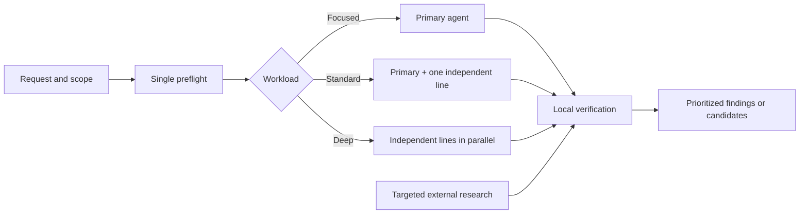

# Z80 Skills — Adaptive Research

**Languages:** English · [Español](README.es.md)

Codex plugin with three complementary skills for analyzing Z80 projects,
especially ZX Spectrum software written in assembly, C, or a mixture of both
using z88dk or SDCC.

The goal is not to produce generic lists of tricks. The skills inspect the
current code and artifacts, adapt depth and parallelism to the actual risk, and
clearly distinguish proven evidence, estimates, and hypotheses.

> Evidence-first auditing, size reduction and multi-objective optimization for
> Z80 and ZX Spectrum projects.

## Contents

- [What is included](#what-is-included)
- [What it adds beyond generic analysis](#what-it-adds-beyond-generic-analysis)
- [Adaptive and multi-agent execution](#adaptive-and-multi-agent-execution)
- [Targeted external research](#targeted-external-research)
- [Skill details](#skill-details)
- [Installation](#installation)
- [Usage](#usage)
- [Recommended artifacts](#recommended-artifacts)
- [Safety and limitations](#safety-and-limitations)
- [Repository structure](#repository-structure)
- [Validation](#validation)
- [License](#license)

## What is included

| Skill | Primary question | Result |
|---|---|---|
| `audit-z80` | Are there defects, corruption, ABI errors, ISR/memory/hardware risks, or regressions? | Findings prioritized by severity and confidence, with evidence, verification, and residual risk. |
| `shrink-z80` | How can storage, linked size, resident memory, BSS/stack, banks, or overlays be reduced? | Net reductions classified by safety and quality of evidence. |
| `optimize-z80` | What is the real bottleneck, and which changes offer the best balance among size, speed, RAM, rendering, and latency? | Up to three prioritized experiments with impact, risk, rollback, and validation plans. |

The three skills overlap only where useful:

- Use `audit-z80` for correctness and technical safety.
- Use `shrink-z80` for an exhaustive search focused exclusively on size.
- Use `optimize-z80` to decide among competing objectives and prioritize the
  next experiments.

## What it adds beyond generic analysis

### Local evidence before folklore

- Only the current code and demonstrably fresh artifacts can confirm a finding
  or improvement.
- Maps, symbols, listings, generated ASM, and linked binaries count as evidence
  only when they correspond to the same revision, configuration, and target.
- Scanners, agents, prior knowledge, forums, and repositories generate
  candidates; they do not replace local verification.
- A stale artifact explicitly lowers confidence to states such as
  `NEEDS BUILD`, `REQUIERE BUILD`, or `SPECULATIVE`.
- In multi-target projects, a proposal passes the promotion gate only when
  every target satisfies its own limits.

### Progressive loading

Each `SKILL.md` acts as a compact dispatcher. Codex first loads the shared
contract and then only the references and scripts relevant to the observed
problem. This avoids adding manuals, techniques, or logs to the context when
they cannot change the result.

### Deterministic tools

The plugin includes dependency-free Python analyzers for profiling the project,
summarizing maps, detecting patterns, inventorying ABI boundaries, assessing
artifact freshness, locating library pulls, and estimating candidates. Their
results are reproducible signals, not automatic verdicts.

## Adaptive and multi-agent execution

The skills do not assume that subagents are available or launch a fixed roster.
After a single preflight, they classify the workload:

| Workload | Strategy |
|---|---|
| **Focused** | The primary agent answers a bounded question without delegation. |
| **Standard** | The primary agent retains verification and, when capacity is available, one delegate investigates the most valuable independent uncertainty. |
| **Deep** | As many useful and available independent lines of inquiry as possible run in parallel, normally with no more than three delegates per wave. |



Efficiency rules:

- Capacity is reserved so that the primary agent retains the full context and
  judges the evidence.
- Each delegate receives the same immutable baseline, a falsifiable question,
  and a narrow set of files or artifacts.
- Branches are independent; they overlap only for deliberate adversarial
  checking.
- Deterministic scanners run once, and a summary—not the complete log—is shared.
- The primary agent deduplicates, applies vetoes, verifies local anchors, and
  retains responsibility for severity, accounting, and ranking.
- A second wave opens only when a new bottleneck, contradiction, or concrete
  verification question appears.
- Analysis stops when new lines of inquiry only repeat candidates or can no
  longer change the decision.
- If subagents are unavailable, the lines that can still change the result are
  examined serially. The evidence threshold is not lowered.

## Targeted external research

External research is activated to resolve a specific uncertainty, not to
decorate the report or repeat a list of well-known sites.

### When it is activated

- The user requests deep research across forums, blogs, repositories, or the
  demoscene.
- A compiler version, ABI, firmware, emulator, hardware model, or timing detail
  can change a primary finding.
- The code, generated artifacts, and documentation contradict one another.
- A deep analysis retains a material blind spot.
- An instruction sequence, helper, codec, renderer, loader, or banking scheme
  requires code archaeology.

### How it searches

1. Formulate a question from a minimal local signature: opcode, symbol, emitted
   fragment, version, address, symptom, or constraint.
2. Search for exact fragments and concepts using alternative terminology.
3. Expand terms across English, Spanish, Polish, Russian, Czech, and other
   relevant regional communities.
4. Diversify sources: code, tests, commits, issues, forks, emulators, hardware
   measurements, mailing lists, archived forums, personal blogs, small
   repositories, disassemblies, generators, and demoscene material.
5. Follow authors, citations, forks, related issues, and archived links.
6. Try to refute each finalist by looking for bugs, regressions, closed or
   rejected issues, and model-specific failures.
7. Verify the CPU, Spectrum model, ABI, interrupts, paging, memory, toolchain,
   and timing before transferring a technique.

Research has a budget and stopping rules: it retains only the few sources that
can change a decision. A popular technique without a project-local anchor
remains a hypothesis.

To protect private projects, searches use only minimal normalized signatures;
they must never upload private code or project identifiers.

## Skill details

### `audit-z80`

Read-only auditing for finding real defects and reproducible risks.

**Coverage**

- C/ASM boundaries, calling conventions, registers, flags, and stack;
- ISRs, `DI`/`EI`, reentrancy, and shared state;
- memory maps, BSS, stack gap, banks, and overlays;
- firmware, ROM, RST 8, esxDOS, divMMC, and differences among models;
- C semantics, buffers, promotion, signedness, and lifetime;
- generated ASM/listings, copt rules, and z88dk/SDCC behavior;
- ULA, contention, ports, timing, and user-visible regressions.

**Modes**

- `auto`: preflight and adaptive depth.
- `preflight`: profile and escalation signals without a full audit.
- `full` / `diverge`: broad coverage with the same evidence gates.
- Focus areas: `asm`, `c`, `abi`, `isr`, `memory`, `spectrum-hw`, `esxdos`,
  `toolchain`, `copt`, and `map`.

**Primary helpers**

- `preflight_scan.py`: inventory of sources, artifacts, and risk signals.
- `z80_pattern_scan.py`: structural ASM/C patterns.
- `abi_inventory.py`: declarations, conventions, and C/ASM boundaries.
- `map_summary.py`: symbols, addresses, and stack-gap approximation.
- `smoke_test.py`: reproducible checks for the analyzers.

The output puts findings that pass the promotion gate first. If none survive,
it says so and identifies the most important residual risk instead of padding
the report with weak observations.

### `shrink-z80`

Size optimizer based on measurement and net accounting.

**Separate objectives**

- storage size;
- linked CODE/DATA;
- resident memory;
- BSS and stack headroom;
- bank or overlay ceiling;
- minimum reserve per target.

**Modes**

- `scan`: complete adaptive analysis.
- `preflight`: artifact and pressure profile.
- Focus areas: `deadcode`, `dedup`, `micro`, `data`, `compress`, `refactor`,
  `arch`, `libpull`, `blackbelt`, and `reserve`.
- `diverge`: broad exploration without relaxing the proof requirements.

**Order of attack**

1. Architecture, residency, data, and linked libraries.
2. Generated code, helpers, and repeated representations.
3. Compression with net cost and peak RAM accounted for separately.
4. Micro-optimizations and higher-risk techniques only when they can matter.

It does not add together proposals that are dependent, subsumed, incompatible,
or not yet built. It distinguishes safety (`SAFE`, `AGGRESSIVE`,
`EXPERIMENTAL`) and measurement quality (`EXACTO`, `ESTIMADO`,
`REQUIERE BUILD`).

**Primary helpers**

- `preflight_scan.py` and `artifact_freshness.py`;
- `map_summary.py`, `deadcode_scan.py`, and `libpull_scan.py`;
- `generated_helper_scan.py` and `literal_dup_scan.py`;
- `z80_pattern_scan.py`;
- `net_compression_check.py`, which separates storage savings from peak RAM.

### `optimize-z80`

Multi-objective strategy engine for deciding what to optimize first and how to
validate it.

**Areas**

- size, cycles, and latency;
- RAM, stack, and data layout;
- rendering, contention, and I/O;
- banks, overlays, and transitions;
- C-to-ASM, ABI, libraries, code generation, and toolchain;
- model- and hardware-specific constraints.

**Modes**

- `Triage`: read-only inspection without a build. Stale artifacts limit
  confidence.
- `Measurement`: reproducible baseline in a disposable worktree.
- `Experiment`: requires explicit approval, changes a single variable, and is
  deleted unless the user asks to keep it.

It first identifies the dominant bottleneck. It then applies policy and target
vetoes, merges duplicates, audits the finalists, and recommends no more than
three next experiments.

Each candidate includes:

- evidence anchor and freshness;
- area, mechanism, and expected impact;
- effect on size, cycles/latency, RAM/stack, and UX where applicable;
- risk, targets, constraints, rollback, and validation;
- confidence (`PROVEN`, `LIKELY`, or `SPECULATIVE`);
- the reason it currently outranks the alternatives.

Static cycle, map, or pattern estimators do not constitute proof by themselves.

## Installation

### Requirements

- Codex with plugin and skill support.
- Git to clone and update the repository.
- Python 3.9 or later for the helpers; Python 3.11 or later is recommended for
  the complete TOML policy path in `optimize-z80`.
- z88dk or SDCC only when required by the project or a reproducible measurement.

### Initial installation

The installer expects the repository to be located exactly at
`~/plugins/z80-skills`.

```sh
git clone https://github.com/IgnacioMonge/z80-skills.git ~/plugins/z80-skills
cd ~/plugins/z80-skills
python3 scripts/install_personal_marketplace.py
codex plugin add z80-skills@personal
```

`install_personal_marketplace.py` creates or updates
`~/.agents/plugins/marketplace.json`, preserves all other entries, and replaces
only the entry named `z80-skills`.

Open a new Codex task after installing: the skill catalog is loaded when the
task starts and does not update dynamically within an already open task.

### Updating

```sh
git -C ~/plugins/z80-skills pull --ff-only
codex plugin add z80-skills@personal
```

After updating, open a new task again.

## Usage

The skills are invoked through natural language. The more specific the target,
objective, and available artifacts are, the more precise the prioritization
will be.

### Auditing

```text
Use audit-z80 in auto mode to review this mixed ASM/C project.
Prioritize ABI, ISR, and memory; report only findings anchored in the current code.
```

```text
Use audit-z80 in full mode. Review the differences between the 48K and 128K targets,
including paging, ROM, stack, interrupts, and generated artifacts.
```

### Size reduction

```text
Use shrink-z80 in scan mode. I need to recover at least 512 bytes of CODE/DATA
without changing behavior, and keep exact savings separate from estimated savings.
```

```text
Use shrink-z80 in compress mode to compare the net size and peak RAM of
the codecs applied to these specific assets.
```

### Multi-objective optimization

```text
Use optimize-z80 in Triage mode to identify the real bottleneck and return
the three experiments with the best balance of impact, risk, and cost.
```

```text
Use optimize-z80 in Measurement mode to obtain a fresh baseline without
modifying my main working tree.
```

## Recommended artifacts

The skills can start with source files alone, but these artifacts increase
confidence:

| Evidence | Usefulness |
|---|---|
| `.asm`, `.s`, `.c`, `.h` | Current semantics, ABI boundaries, patterns, and reachability. |
| `.map`, `.sym` | Layout, symbols, sections, banks, library pulls, and stack gap. |
| `.lst` or generated ASM | Actual compiler behavior and code-generation cost. |
| Binaries, TAP files, and assets | Final size, compression, and reproducible comparisons. |
| Build recipe and flags | Reproducibility, toolchain, ABI, and configuration. |
| Explicit targets and limits | Vetoes, reserves, compatibility, and correct ranking. |

A recent timestamp alone does not prove correspondence. The revision,
configuration, and recipe must belong to the same baseline.

## Safety and limitations

- Normal analyses are read-only.
- `audit-z80` and `shrink-z80` do not edit the project.
- `optimize-z80` modifies only a disposable copy in `Experiment` mode and
  requires explicit approval.
- The included scripts use the Python standard library, work with local files,
  and do not perform network searches.
- Tests write to temporary directories and remove them when finished.
- The plugin does not include z88dk, SDCC, emulators, or profiling tools.
- It is not a compiler, hardware profiler, or automatic optimizer.
- It does not confirm linked savings, timings, or compatibility without
  appropriate evidence.
- SMC, SP abuse, `DI`/`EI`, undocumented opcodes, floating bus behavior, and
  other hardware-dependent techniques require risk labels and target-specific
  validation.
- External research must never publish private source code, paths, sensitive
  symbols, or project identifiers.

## Repository structure

```text
LICENSE
README.md
README.es.md
.codex-plugin/
  plugin.json
scripts/
  install_personal_marketplace.py
  run_in_worktree.py
skills/
  audit-z80/
    SKILL.md
    agents/openai.yaml
    references/
    scripts/
  shrink-z80/
    SKILL.md
    agents/openai.yaml
    references/
    scripts/
    tests/
  optimize-z80/
    SKILL.md
    agents/openai.yaml
    references/
    scripts/
```

Each skill keeps its core instructions in `SKILL.md`, selective-loading details
in `references/`, and reproducible analyzers in `scripts/`.

## Validation

Included tests:

```sh
python3 scripts/test_run_in_worktree.py
python3 skills/audit-z80/scripts/smoke_test.py
python3 skills/shrink-z80/tests/run_smoke.py
python3 -m unittest discover -s skills/optimize-z80/scripts -p 'test_*.py'
```

The plugin manifest and the front matter of each skill should also be validated
before publishing a new version.

## License

This project is licensed under the [MIT License](LICENSE).

Copyright © 2026 M. Ignacio Monge García.

## Author

M. Ignacio Monge García
